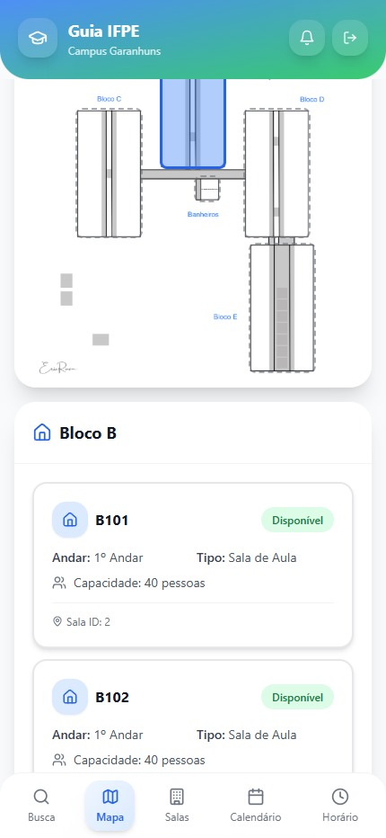
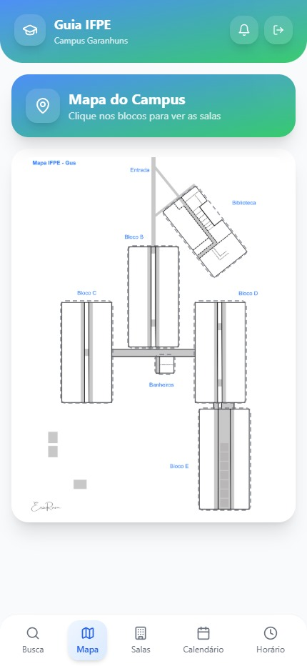
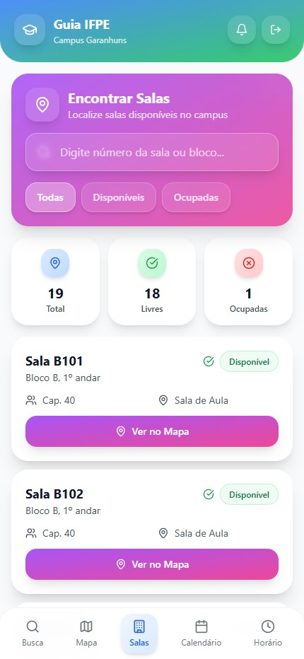
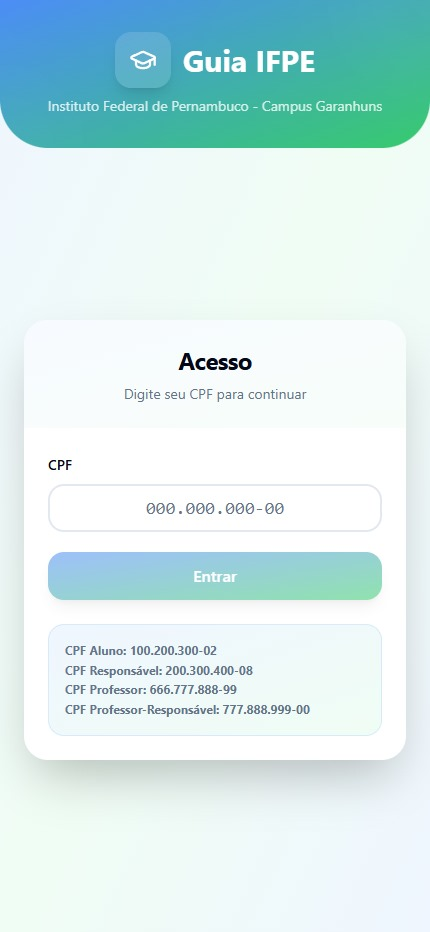

# 🎓 GUIA IFPE — Sistema de Localização Interna

> **Sistema web para auxiliar estudantes e professores a se orientarem dentro do Campus Garanhuns do IFPE**

O Guia IFPE oferece consultas rápidas sobre turmas, disciplinas, professores e salas, ajudando a reduzir atrasos e otimizar o deslocamento no campus.


## 📱 Demonstração

<div align="center">
  
  
  
  
  
  
  
  
</div>

---


## Funcionalidades Principais

- **Login seguro por CPF:** Autenticação via CPF do aluno ou professor, garantindo acesso seguro.
- **Tela inicial personalizada:** Exibe dados acadêmicos do usuário (matrícula, curso, turma etc.).
- **Consulta completa de aluno:**  
  1. Aula atual (disciplina, professor, horário, sala)  
  2. Dados pessoais (CPF, e-mail, telefone, matrícula)  
  3. Dados acadêmicos (curso e turma)
- **Calendário acadêmico unificado:** Exibe horários de cursos integrados, subsequentes e superiores.
- **Grade horária semanal:** Mostra toda a programação semanal do aluno.
- **Mapa interativo do campus:**  
  - Visualização dos blocos  
  - Capacidade das salas  
  - Status livre/ocupada  
  - Tipo de sala (laboratório, sala comum, etc.)
- **Segurança reforçada:** JWT + middlewares de proteção + controle de acesso por papéis.

---

## 🚀 Tecnologias Utilizadas

### Frontend
- **React 18** + **Vite** - Build rápido e moderno
- **TypeScript** - Tipagem estática
- **TailwindCSS** - Estilização
- **shadcn/ui** - Componentes acessíveis
- **React Router** - Roteamento SPA

### Backend
- **Node.js** + **Express** - API REST
- **MySQL 8** - Banco de dados relacional
- **JWT** - Autenticação segura
- **bcrypt** - Hash de senhas

### DevOps
- **Docker** + **Docker Compose** - Containerização
- **Vercel** - Deploy do frontend (opcional)

---

## 🐳 Instalação com Docker (Recomendado)

A forma mais fácil de rodar o projeto é usando Docker. Tudo é configurado automaticamente!

### Pré-requisitos
- [Docker](https://docs.docker.com/get-docker/) instalado
- [Docker Compose](https://docs.docker.com/compose/install/) instalado

### 1. Clonar o repositório

```bash
git clone https://github.com/GuickerZ/GuiaIFPE.git
cd GuiaIFPE
```

### 2. Iniciar com Docker

```bash
# Subir todos os containers (MySQL + Backend + Frontend)
docker-compose up -d

# Ver logs
docker-compose logs -f
```

### 3. Acessar o sistema

| Serviço | URL |
|---------|-----|
| **Frontend** | http://localhost:5173 |
| **Backend API** | http://localhost:3001 |
| **MySQL** | localhost:3306 |

### 4. Parar os containers

```bash
docker-compose down

# Para remover também os dados do banco:
docker-compose down -v
```

---

## 💻 Instalação Manual (Sem Docker)

Se preferir rodar sem Docker:

### 1. Instalar MySQL 8

Instale o MySQL e crie o banco de dados:

```sql
CREATE DATABASE guia_ifpe;
```

Execute o script `scripts/init.sql` para criar as tabelas e dados de exemplo.

### 2. Configurar Backend

```bash
cd backend
npm install

# Copiar e editar .env
cp ../.env.example .env
# Edite o .env com suas configurações

npm start
```

### 3. Configurar Frontend

```bash
# Na raiz do projeto
npm install
npm run dev
```

### 4. Acessar

- Frontend: http://localhost:5173
- Backend: http://localhost:3001

---

## 🔑 Dados de Teste

O banco já vem com dados de exemplo para testar:

| Tipo | CPF | Nome |
|------|-----|------|
| **Aluno** | `123.456.789-01` | Maria Oliveira Costa |
| **Responsável** | `987.654.321-00` | Ana Costa Oliveira |
| **Professor** | `111.222.333-44` | Prof. Roberto Silva |

---

## 📁 Estrutura do Projeto

```
GuiaIFPE/
├── backend/              # API Node.js
│   ├── config/           # Configuração do banco
│   ├── middleware/       # Middlewares (auth, etc)
│   ├── routes/           # Rotas da API
│   ├── server.js         # Servidor Express
│   └── Dockerfile
├── src/                  # Frontend React
│   ├── components/       # Componentes reutilizáveis
│   ├── pages/            # Páginas da aplicação
│   └── hooks/            # Hooks customizados
├── scripts/              # Scripts SQL
│   └── init.sql          # Inicialização do banco
├── docs/                 # Screenshots e documentação
├── docker-compose.yml    # Orquestração Docker
└── .env.example          # Exemplo de variáveis
```

---

## ☁️ Hospedagem Própria (Self-Hosting)

Como o projeto é containerizado com Docker, você pode hospedá-lo facilmente em qualquer VPS ou servidor local.

### Requisitos do Servidor
- 1GB RAM (mínimo)
- Docker & Docker Compose instalados

### Passos para Deploy

1. **Clone o repositório no servidor:**
   ```bash
   git clone https://github.com/GuickerZ/GuiaIFPE.git
   cd GuiaIFPE
   ```

2. **Configure o ambiente:**
   Edite o `docker-compose.yml` se precisar alterar portas ou senhas.

3. **Inicie o serviço:**
   ```bash
   docker-compose up -d
   ```

O sistema estará rodando na porta 80 (ou a que você configurou).

---

## Agradecimentos

Agradecimento especial ao corpo docente envolvido na avaliação e orientação do trabalho, assim como às contribuições institucionais durante o desenvolvimento do projeto.  

---

## Licença

Este projeto é licenciado sob a **MIT License**.

---
